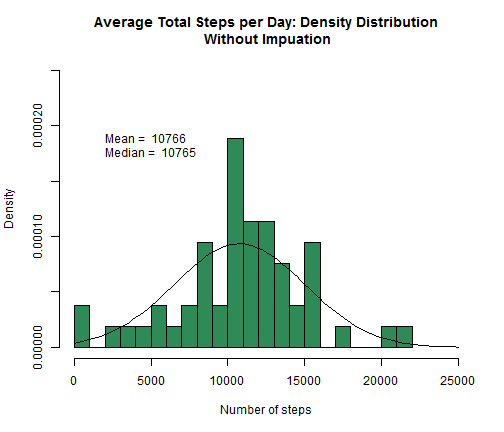
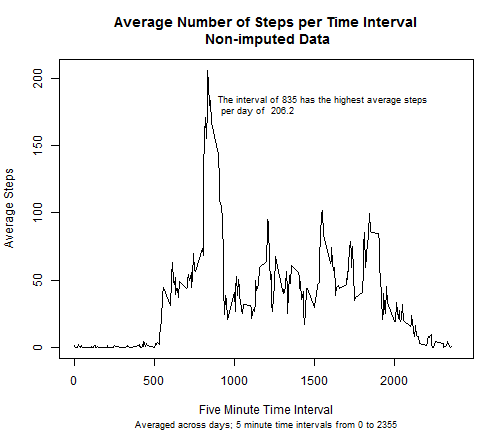
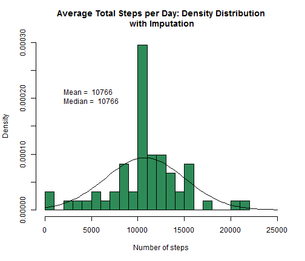
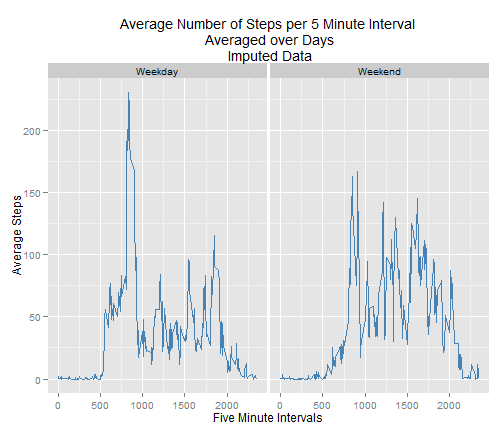

## Loading and preprocessing the data
First steps include loading libraries, unzipping the data file and reading in CSV data. Investigate a few records and the overall structure of the data.

```r
library(sqldf)
```

```
## Warning: package 'sqldf' was built under R version 3.1.2
```

```
## Loading required package: gsubfn
## Loading required package: proto
## Loading required package: RSQLite
```

```
## Warning: package 'RSQLite' was built under R version 3.1.2
```

```
## Loading required package: DBI
```

```
## Warning: package 'DBI' was built under R version 3.1.2
```

```r
library(Hmisc)
```

```
## Loading required package: grid
## Loading required package: lattice
## Loading required package: survival
## Loading required package: splines
## Loading required package: Formula
## 
## Attaching package: 'Hmisc'
## 
## The following objects are masked from 'package:base':
## 
##     format.pval, round.POSIXt, trunc.POSIXt, units
```

```r
library(dplyr)
```

```
## Warning: package 'dplyr' was built under R version 3.1.2
```

```
## 
## Attaching package: 'dplyr'
## 
## The following objects are masked from 'package:Hmisc':
## 
##     src, summarize
## 
## The following object is masked from 'package:stats':
## 
##     filter
## 
## The following objects are masked from 'package:base':
## 
##     intersect, setdiff, setequal, union
```

```r
library(lubridate)
library(ggplot2)
library(xtable)
```

```
## Warning: package 'xtable' was built under R version 3.1.2
```

```
## 
## Attaching package: 'xtable'
## 
## The following objects are masked from 'package:Hmisc':
## 
##     label, label<-
```

```r
directories<-list.dirs(path="./projectdat",   full.names=TRUE)
num<-length(directories)
direct<-list.files(directories[1:num], full.names=TRUE)

activity<-read.csv(direct[1], header = TRUE, sep = ",")
activity$Date2<-as.Date(strptime(activity$date, "%Y-%m-%d"))
head(activity, 5)
```

```
##   steps       date interval      Date2
## 1    NA 2012-10-01        0 2012-10-01
## 2    NA 2012-10-01        5 2012-10-01
## 3    NA 2012-10-01       10 2012-10-01
## 4    NA 2012-10-01       15 2012-10-01
## 5    NA 2012-10-01       20 2012-10-01
```

```r
str(activity)
```

```
## 'data.frame':	17568 obs. of  4 variables:
##  $ steps   : int  NA NA NA NA NA NA NA NA NA NA ...
##  $ date    : Factor w/ 61 levels "2012-10-01","2012-10-02",..: 1 1 1 1 1 1 1 1 1 1 ...
##  $ interval: int  0 5 10 15 20 25 30 35 40 45 ...
##  $ Date2   : Date, format: "2012-10-01" "2012-10-01" ...
```

```r
listnames<-c(names(activity))
```


## What is mean total number of steps taken per day?
Here I will ignore the 5 minute interval and get the sum of total steps per day. Then, I will plot a histogram.

```r
sumsteps<-with(activity, aggregate(steps, list(date),sum))
```
Here is the histogram. I choose to plot the density function and overlay the normal distribution curve. I included the mean and the median values on the plot. Overall, the distribution looks somewhat normal. 

```r
meansteps<-mean(sumsteps$x, na.rm=TRUE)
std<-sqrt(var(sumsteps$x, na.rm=TRUE))
mediansteps<-median(sumsteps$x,na.rm=TRUE)

hist(sumsteps$x, col=c("seagreen"), main="Average Total Steps per Day: Density Distribution\n Without Impuation", 
     xlab="Number of steps", breaks=30, prob=TRUE, ylim=c(0,0.00025), xlim=c(0,25000))
mtext(paste("Mean = ", round(meansteps,digits=0), sep=" "),  line=-6, at=2000, adj=0)
mtext(paste("Median = ", round(mediansteps,digits=0), sep=" "),  line=-7, at=2000, adj=0)
curve(dnorm(x, mean=meansteps, sd=std), add=TRUE)
```

 

## what is the mean and median steps per date?
Shown on the graph are the mean of 10766 and median of 10765 steps per day.

## What is the average daily activity pattern?
Using the aggregate function, take the mean steps per 5 minute interval. This will show the averaged pattern within each 5 minute time frame pooled over all of the days. This mean is taken on the raw (non-imputed) data. 

```r
avesteps_in<-with(activity, aggregate(steps, list(interval),mean, na.rm=TRUE))
maxval<-max(avesteps_in$x)
result2<-avesteps_in[avesteps_in$x==maxval,]
```


```r
plot(x=avesteps_in$Group.1, y=avesteps_in$x, 
     ylab="Average Steps", lty=1, type="l", pch=NA, 
     xlim=c(0,2400), xlab="Five Minute Time Interval" )
mtext(paste("The interval of", result2[1], "has the highest average steps\n", "per day of ",
            round(result2[2],digits=1), sep=" "), at=900, line=-4, adj=0, cex=0.75)
title(main="Average Number of Steps per Time Interval\n Non-imputed Data", 
      sub="Averaged across days; 5 minute time intervals from 0 to 2355",
      cex.sub=0.75)
```

 

## Imputing missing values
Below I first run a small loop to check where data is missing. Do we have missing dates, intervals, or steps? List one shows that all the missing values are within the steps field. 

```r
list1<-c(rep(0,ncol(activity)))
for (i in 1:ncol(activity)){
        list1[i]<-sum(is.na(activity[,i]))
}
names(list1)<-listnames
list1
```

```
##    steps     date interval    Date2 
##     2304        0        0        0
```

```r
result<-sum(complete.cases(activity))
```
There are 2304 missing values for steps. Investigate further to see that there are 8 dates where no date was recorded (all intervals have missing values). I choose to impute using the mean value that was obtained in the first part of this exercise over days per five minute interval. See the coding steps below for how this was performed. 


```r
missingdat<-activity[is.na(activity$steps),]
completedat<-na.omit(activity)

avesteps_in$interval<-avesteps_in$Group.1
avesteps_in<-avesteps_in[order(avesteps_in$interval),]
missingdat<-missingdat[order(missingdat$interval),]
impute<-merge(x=missingdat[,c(2,3,4)],y=avesteps_in, by.x="interval", by.y="interval", all.x=TRUE)
impute<-impute %>%
         select(interval, date, Date2, x) %>%
          mutate(steps=x)
dataimp<-rbind(completedat,impute[,c(1,2,3,5)])  
miss_wkdy<-weekdays(missingdat$Date2)
```
Here are the 8 dates where all 288 interval values are missing. Make sure that these are not all on the weekends or weekdays as well.

```r
xt1<-xtable(table(missingdat$Date2))
print(xt1, type="html")
```

<!-- html table generated in R 3.1.1 by xtable 1.7-4 package -->
<!-- Sat Nov 15 16:08:10 2014 -->
<table border=1>
<tr> <th>  </th> <th> V1 </th>  </tr>
  <tr> <td align="right"> 2012-10-01 </td> <td align="right"> 288 </td> </tr>
  <tr> <td align="right"> 2012-10-08 </td> <td align="right"> 288 </td> </tr>
  <tr> <td align="right"> 2012-11-01 </td> <td align="right"> 288 </td> </tr>
  <tr> <td align="right"> 2012-11-04 </td> <td align="right"> 288 </td> </tr>
  <tr> <td align="right"> 2012-11-09 </td> <td align="right"> 288 </td> </tr>
  <tr> <td align="right"> 2012-11-10 </td> <td align="right"> 288 </td> </tr>
  <tr> <td align="right"> 2012-11-14 </td> <td align="right"> 288 </td> </tr>
  <tr> <td align="right"> 2012-11-30 </td> <td align="right"> 288 </td> </tr>
   </table>

```r
xt2<-xtable(table(miss_wkdy))
print(xt2, type="html")
```

<!-- html table generated in R 3.1.1 by xtable 1.7-4 package -->
<!-- Sat Nov 15 16:08:10 2014 -->
<table border=1>
<tr> <th>  </th> <th> miss_wkdy </th>  </tr>
  <tr> <td align="right"> Friday </td> <td align="right"> 576 </td> </tr>
  <tr> <td align="right"> Monday </td> <td align="right"> 576 </td> </tr>
  <tr> <td align="right"> Saturday </td> <td align="right"> 288 </td> </tr>
  <tr> <td align="right"> Sunday </td> <td align="right"> 288 </td> </tr>
  <tr> <td align="right"> Thursday </td> <td align="right"> 288 </td> </tr>
  <tr> <td align="right"> Wednesday </td> <td align="right"> 288 </td> </tr>
   </table>
Similar to the first part of this exercise, a histogram is plotted after the imputation steps. Here, intervals are ignored and averages are taken across dates. The mean and median values are computed. Although the histograms look a bit different, using the mean value inputation allowed the overall means and medians to stay very much the same as observed in the raw data.

```r
sumsteps2<-with(dataimp, aggregate(steps, list(date),sum))
meansteps2<-mean(sumsteps2$x, na.rm=TRUE)
std2<-sqrt(var(sumsteps2$x, na.rm=TRUE))
mediansteps2<-median(sumsteps2$x,na.rm=TRUE)
```


```r
hist(sumsteps2$x, col=c("seagreen"), main="Average Total Steps per Day: Density Distribution\n with Imputation", 
     xlab="Number of steps", breaks=30, prob=TRUE, ylim=c(0,0.00030), xlim=c(0,25000))
mtext(paste("Mean = ", round(meansteps2,digits=0), sep=" "),  line=-7, at=2000, adj=0)
mtext(paste("Median = ", round(mediansteps2,digits=0), sep=" "),  line=-8, at=2000, adj=0)
curve(dnorm(x, mean=meansteps2, sd=std), add=TRUE)
```

 

## Are there differences in activity patterns between weekdays and weekends?
With the imputed data, first set up weekdays versus weekends. Show tables results as this category is formed with the dates.


```r
dataimp$wkday<-factor(weekdays(dataimp$Date2))
table(dataimp$wkday)
```

```
## 
##    Friday    Monday  Saturday    Sunday  Thursday   Tuesday Wednesday 
##      2592      2592      2304      2304      2592      2592      2592
```

```r
dataimp$wkend<-factor(dataimp$wkday%in%c("Saturday","Sunday"), levels=c(FALSE,TRUE), 
                      labels=c("Weekday","Weekend"))
table(dataimp$wkend,dataimp$wkday)
```

```
##          
##           Friday Monday Saturday Sunday Thursday Tuesday Wednesday
##   Weekday   2592   2592        0      0     2592    2592      2592
##   Weekend      0      0     2304   2304        0       0         0
```
Now, repeat the averaging of steps for each 5 minute interval pooled over days but do it separately for weekdays versus weekends.

```r
avesteps_in2<-with(dataimp, aggregate(steps, list(interval,wkend),mean, na.rm=TRUE))
maxval2<-with(avesteps_in2, aggregate(x, list(Group.2), max))
maxval2
```

```
##   Group.1        x
## 1 Weekday 230.3782
## 2 Weekend 166.6392
```

```r
result22<-avesteps_in2[avesteps_in2$x%in%c(maxval2$x),]
result22
```

```
##     Group.1 Group.2        x
## 104     835 Weekday 230.3782
## 400     915 Weekend 166.6392
```
Plot the trends by weekday versus weekend. It is clear that there is a spike of activity on weekdays that occurs around 8:35. The spike occurs later on weekends around 9:15 and is not nearly as high. The activity during the day stays starts later and stays at a higher plateua on the weekends compared to weekdays. 


```r
p<-ggplot(avesteps_in2, aes(x=Group.1, y=x)) + geom_line(color=c("steelblue"))
p+facet_grid(.~Group.2)+xlab("Five Minute Intervals")+ylab("Average Steps") + ggtitle("Average Number of Steps per 5 Minute Interval\n Averaged over Days\n Imputed Data")
```

 

