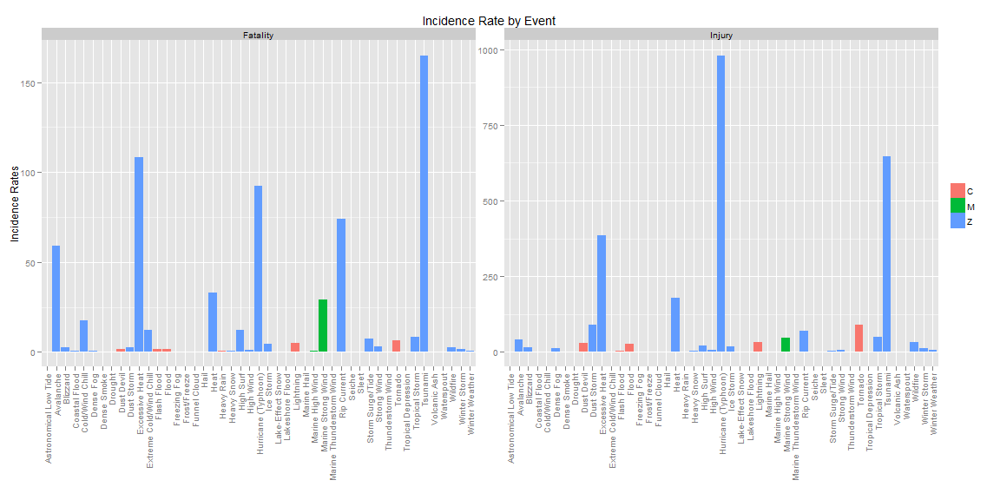
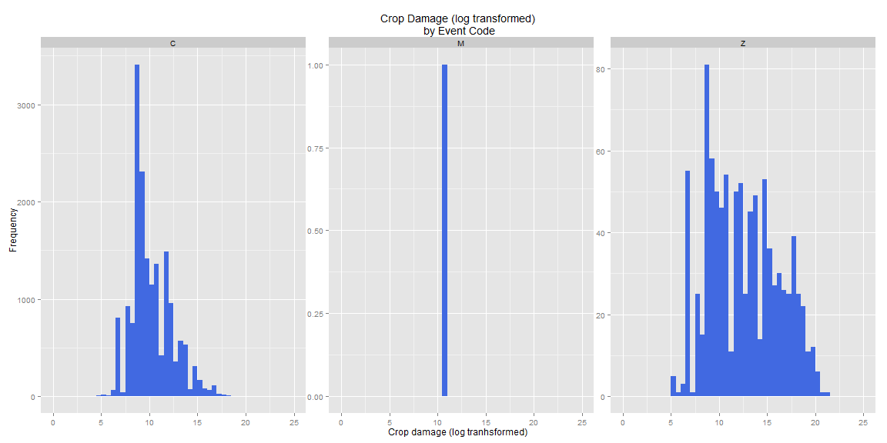
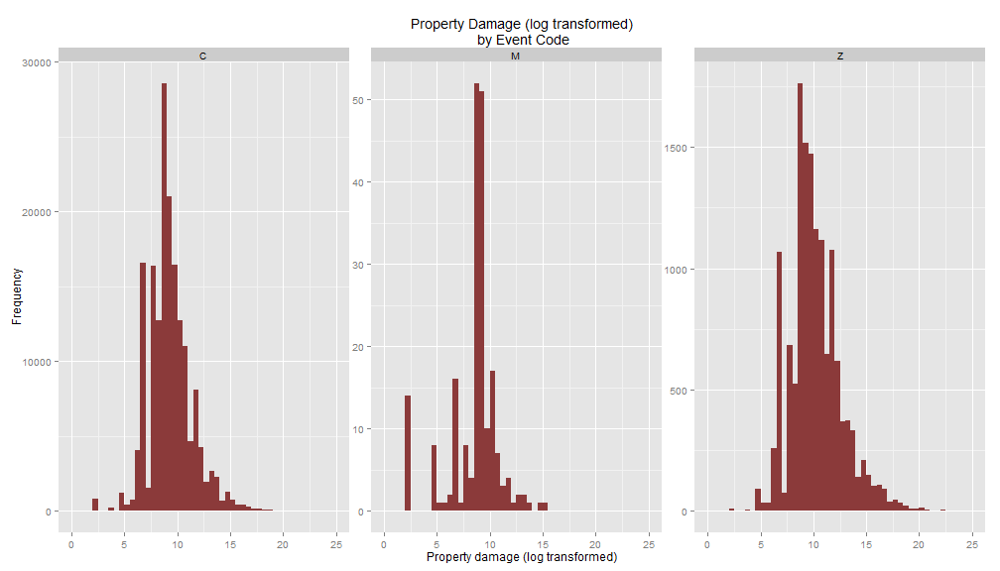

# Analysis of National Weather Service Storm Data
The purpose of this analysis is to use the National Weather Service Storm data to answer two questions:
- Across the United States, which types of events are most harmful to population health?
- Across the United States, which types of events have the greatest economic consequences?

## Synopsis
In order to complete this analysis, data and documentation were obtained from links provided on the class website. The documentation provided a list of 48 distinct event types with code designations. These designations were put in place in 1996. Thus, it was determined that the analysis would be based on events that occured from 1996 onwards in order to reliably incorporate these 48 event codes.

Due to the complexity of the data and the scope of this assignment, durations of events were not considered in this analysis. While it is likely not to be true, each data record will be assumed to be independant and simple summaries will be performed to broadly answer the questions posed above.

The two measures that will be used to summarize population health include fatalities and injuries; the two measures used to summarize economic consequences include crop damage and property damage.


## Data Processing

### Step one

- First, load required libraries then obtain the data.


```r
library(sqldf)
```

```
## Warning: package 'sqldf' was built under R version 3.1.2
```

```
## Loading required package: gsubfn
## Loading required package: proto
## Loading required package: RSQLite
```

```
## Warning: package 'RSQLite' was built under R version 3.1.2
```

```
## Loading required package: DBI
```

```
## Warning: package 'DBI' was built under R version 3.1.2
```

```r
library(Hmisc)
```

```
## Loading required package: grid
## Loading required package: lattice
## Loading required package: survival
## Loading required package: splines
## Loading required package: Formula
## 
## Attaching package: 'Hmisc'
## 
## The following objects are masked from 'package:base':
## 
##     format.pval, round.POSIXt, trunc.POSIXt, units
```

```r
library(plyr)
```

```
## 
## Attaching package: 'plyr'
## 
## The following objects are masked from 'package:Hmisc':
## 
##     is.discrete, summarize
```

```r
library(dplyr)
```

```
## Warning: package 'dplyr' was built under R version 3.1.2
```

```
## 
## Attaching package: 'dplyr'
## 
## The following objects are masked from 'package:plyr':
## 
##     arrange, count, desc, failwith, id, mutate, rename, summarise,
##     summarize
## 
## The following objects are masked from 'package:Hmisc':
## 
##     src, summarize
## 
## The following object is masked from 'package:stats':
## 
##     filter
## 
## The following objects are masked from 'package:base':
## 
##     intersect, setdiff, setequal, union
```

```r
library(ggplot2)
library(stringr)
library(lubridate)
```

```
## 
## Attaching package: 'lubridate'
## 
## The following object is masked from 'package:plyr':
## 
##     here
```

```r
library(xtable)
```

```
## Warning: package 'xtable' was built under R version 3.1.2
```

```
## 
## Attaching package: 'xtable'
## 
## The following objects are masked from 'package:Hmisc':
## 
##     label, label<-
```

```r
Sys.info()
```

```
##                      sysname                      release 
##                    "Windows"                      "7 x64" 
##                      version                     nodename 
## "build 7601, Service Pack 1"                "DCRI-SL3318" 
##                      machine                        login 
##                     "x86-64"                      "jaw14" 
##                         user               effective_user 
##                      "jaw14"                      "jaw14"
```

```r
if (!file.exists("projectdat")){
        dir.create("projectdat")
}
urlname<-"https://d396qusza40orc.cloudfront.net/repdata%2Fdata%2FStormData.csv.bz2"
download.file(url=urlname, destfile="./projectdat/stormdata.csv.bz2")
```

```
## Error in download.file(url = urlname, destfile = "./projectdat/stormdata.csv.bz2"): unsupported URL scheme
```

```r
downLoaddate<-date()

csvfile<-"./codelist.csv"
filename<-"./projectdat/stormdata.csv.bz2"

stormdat <- read.table(filename, comment.char = "#", 
                  header = TRUE, sep = ",", na.strings = " ")

stormdat$BDate<-as.Date(strptime(stormdat$BGN_DATE, "%m/%d/%Y"))
analdat<-stormdat[stormdat$BDate >= as.Date("1996-01-01"),]
str(analdat)
```

```
## 'data.frame':	653530 obs. of  38 variables:
##  $ STATE__   : num  1 1 1 1 1 1 1 1 1 1 ...
##  $ BGN_DATE  : Factor w/ 16335 levels "1/1/1966 0:00:00",..: 764 69 69 69 69 255 255 285 464 464 ...
##  $ BGN_TIME  : Factor w/ 3608 levels "00:00:00 AM",..: 1384 1094 1114 1214 1280 853 1023 2144 562 572 ...
##  $ TIME_ZONE : Factor w/ 22 levels "ADT","AKS","AST",..: 7 7 7 7 7 7 7 7 7 7 ...
##  $ COUNTY    : num  1 31 31 45 67 125 1 75 51 101 ...
##  $ COUNTYNAME: Factor w/ 29601 levels "","5NM E OF MACKINAC BRIDGE TO PRESQUE ISLE LT MI",..: 737 2926 2926 4388 5778 24418 734 10074 4558 13540 ...
##  $ STATE     : Factor w/ 72 levels "AK","AL","AM",..: 2 2 2 2 2 2 2 2 2 2 ...
##  $ EVTYPE    : Factor w/ 985 levels "   HIGH SURF ADVISORY",..: 972 834 856 856 856 244 359 856 856 856 ...
##  $ BGN_RANGE : num  0 5 0 0 0 8 0 0 8 23 ...
##  $ BGN_AZI   : Factor w/ 35 levels "","  N"," NW",..: 1 14 1 1 1 21 1 1 17 22 ...
##  $ BGN_LOCATI: Factor w/ 54429 levels "","- 1 N Albion",..: 1 25146 15520 38419 21271 49638 1 50473 52699 31662 ...
##  $ END_DATE  : Factor w/ 6663 levels "","1/1/1993 0:00:00",..: 531 42 42 42 42 174 193 193 305 305 ...
##  $ END_TIME  : Factor w/ 3647 levels ""," 0900CST",..: 442 974 992 1059 1125 760 749 1886 521 531 ...
##  $ COUNTY_END: num  0 0 0 0 0 0 0 0 0 0 ...
##  $ COUNTYENDN: logi  NA NA NA NA NA NA ...
##  $ END_RANGE : num  0 5 0 0 0 8 0 0 8 0 ...
##  $ END_AZI   : Factor w/ 24 levels "","E","ENE","ESE",..: 1 9 1 1 1 14 1 1 10 1 ...
##  $ END_LOCATI: Factor w/ 34506 levels "","- .5 NNW",..: 1 16298 10081 24389 13781 31439 1 31961 33339 20494 ...
##  $ LENGTH    : num  0 1 0 0 0 0 0 0 0 0 ...
##  $ WIDTH     : num  0 75 0 0 0 0 0 0 0 0 ...
##  $ F         : int  NA 1 NA NA NA NA NA NA NA NA ...
##  $ MAG       : num  0 0 0 0 0 75 40 50 50 50 ...
##  $ FATALITIES: num  0 0 0 0 0 0 0 0 0 0 ...
##  $ INJURIES  : num  0 0 0 0 0 0 0 0 0 0 ...
##  $ PROPDMG   : num  380 100 3 5 2 0 400 12 8 12 ...
##  $ PROPDMGEXP: Factor w/ 19 levels "","-","?","+",..: 17 17 17 17 17 1 17 17 17 17 ...
##  $ CROPDMG   : num  38 0 0 0 0 0 0 0 0 0 ...
##  $ CROPDMGEXP: Factor w/ 9 levels "","?","0","2",..: 7 1 1 1 1 1 1 1 1 1 ...
##  $ WFO       : Factor w/ 542 levels ""," CI","$AC",..: 113 503 503 503 503 113 113 113 113 113 ...
##  $ STATEOFFIC: Factor w/ 250 levels "","ALABAMA, Central",..: 2 4 4 4 4 2 2 2 2 2 ...
##  $ ZONENAMES : Factor w/ 25112 levels "","                                                                                                                               "| __truncated__,..: 11608 1 1 1 1 1 11611 1 1 1 ...
##  $ LATITUDE  : num  0 3116 3119 3119 3121 ...
##  $ LONGITUDE : num  0 8608 8551 8533 8521 ...
##  $ LATITUDE_E: num  0 3116 3119 3119 3121 ...
##  $ LONGITUDE_: num  0 8608 8551 8533 8521 ...
##  $ REMARKS   : Factor w/ 436780 levels "","-2 at Deer Park\n",..: 53466 45113 354731 68039 68062 71654 296502 356374 74909 353279 ...
##  $ REFNUM    : num  248768 248769 248770 248771 248772 ...
##  $ BDate     : Date, format: "1996-01-06" "1996-01-11" ...
```

### Step Two

I decided to copy the codelist into a CSV file and read it in. I will perform some careful string processing so that I can join the categories and their codes onto the actual data.


```r
evtcode<-read.csv(csvfile, header=TRUE, sep=",")
evtcode$EVTYPE_CD<-factor(evtcode$EVTYPE_CD)
str(evtcode)
```

```
## 'data.frame':	48 obs. of  2 variables:
##  $ EVTYPE_CD: Factor w/ 48 levels "Astronomical Low Tide",..: 1 2 3 4 5 6 7 8 9 10 ...
##  $ CODE     : Factor w/ 3 levels "C","M","Z": 3 3 3 3 3 1 3 3 3 1 ...
```

```r
search1<-str_trim(toupper(evtcode[,1]), side="both")
search1<-gsub("\\s", "", search1)
search1<-data.frame(gsub("[[:punct:]]", "", search1))
namesearch<-c("newtype")
names(search1)<-namesearch
evtcode<-data.frame(cbind(evtcode,search1))

evtcode<-evtcode[-c(25),]
searchadd<-data.frame(matrix(c("Hurricane (Typhoon)", "Hurricane (Typhoon)", 
                               "Z", "Z", "HURRICANE", "TYPHOON"), ncol=3, nrow=2))
namesearch<-c("EVTYPE_CD", "CODE", "newtype")
names(searchadd)<-namesearch

finallist<-rbind(evtcode,searchadd)
print(finallist,print.gap=1)
```

```
##                    EVTYPE_CD CODE                newtype
## 1      Astronomical Low Tide    Z    ASTRONOMICALLOWTIDE
## 2                  Avalanche    Z              AVALANCHE
## 3                   Blizzard    Z               BLIZZARD
## 4              Coastal Flood    Z           COASTALFLOOD
## 5            Cold/Wind Chill    Z          COLDWINDCHILL
## 6                Debris Flow    C             DEBRISFLOW
## 7                  Dense Fog    Z               DENSEFOG
## 8                Dense Smoke    Z             DENSESMOKE
## 9                    Drought    Z                DROUGHT
## 10                Dust Devil    C              DUSTDEVIL
## 11                Dust Storm    Z              DUSTSTORM
## 12            Excessive Heat    Z          EXCESSIVEHEAT
## 13   Extreme Cold/Wind Chill    Z   EXTREMECOLDWINDCHILL
## 14               Flash Flood    C             FLASHFLOOD
## 15                     Flood    C                  FLOOD
## 16              Frost/Freeze    Z            FROSTFREEZE
## 17              Funnel Cloud    C            FUNNELCLOUD
## 18              Freezing Fog    Z            FREEZINGFOG
## 19                      Hail    C                   HAIL
## 20                      Heat    Z                   HEAT
## 21                Heavy Rain    C              HEAVYRAIN
## 22                Heavy Snow    Z              HEAVYSNOW
## 23                 High Surf    Z               HIGHSURF
## 24                 High Wind    Z               HIGHWIND
## 26                 Ice Storm    Z               ICESTORM
## 27          Lake-Effect Snow    Z         LAKEEFFECTSNOW
## 28           Lakeshore Flood    Z         LAKESHOREFLOOD
## 29                 Lightning    C              LIGHTNING
## 30               Marine Hail    M             MARINEHAIL
## 31          Marine High Wind    M         MARINEHIGHWIND
## 32        Marine Strong Wind    M       MARINESTRONGWIND
## 33  Marine Thunderstorm Wind    M MARINETHUNDERSTORMWIND
## 34               Rip Current    Z             RIPCURRENT
## 35                    Seiche    Z                 SEICHE
## 36                     Sleet    Z                  SLEET
## 37          Storm Surge/Tide    Z         STORMSURGETIDE
## 38               Strong Wind    Z             STRONGWIND
## 39         Thunderstorm Wind    C       THUNDERSTORMWIND
## 40                   Tornado    C                TORNADO
## 41       Tropical Depression    Z     TROPICALDEPRESSION
## 42            Tropical Storm    Z          TROPICALSTORM
## 43                   Tsunami    Z                TSUNAMI
## 44              Volcanic Ash    Z            VOLCANICASH
## 45                Waterspout    M             WATERSPOUT
## 46                  Wildfire    Z               WILDFIRE
## 47              Winter Storm    Z            WINTERSTORM
## 48            Winter Weather    Z          WINTERWEATHER
## 481      Hurricane (Typhoon)    Z              HURRICANE
## 49       Hurricane (Typhoon)    Z                TYPHOON
```

```r
rm(evtcode,namesearch, searchadd,search1)
```

### Step Three

Next, I manipulate the format on the EVTYPE variable. I will match the first character sequence in this processed string variable to match with the labels on the code list. 


```r
newstring<-str_trim(toupper(analdat$EVTYPE), side="both")
newstring<-gsub("\\s", "", newstring)
newstring<-gsub("[[:punct:]]", "", newstring)

newstring<-gsub(str_trim("TSTM", side="both"),str_trim("THUNDERSTORM", side="both"),newstring)
analdat$newstring<-newstring
rm(newstring)
```

### Step Four

Create a function to attach the event type codes to the data. Check to make sure I have maintained unique levels for the REFNUM before joining the code back onto the entire data set. Here I also go ahead and assign a code of "UNK" to the uncoded records. I will investigate them but then will not retain them for the analysis.


```r
getsub<-function(num1){
        mypattern<-as.character(finallist[num1,3])
        mypattern<-str_trim(mypattern, side="both")
        myfactor<-as.character(finallist[num1,1])
        mycode<-as.character(finallist[num1,2])
        
        ## here is the trimming of the variable in the data base to
        ## match the length in the codelist
        analdat$new<-substr(analdat$newstring,1,str_length(mypattern))
        
        analdat$varn<-ifelse(str_detect(analdat$new,pattern=mypattern)==TRUE, 1,0)
        if (sum(analdat$varn)==0) stop(paste("No observations of this type: ", mypattern))
        
        ## get data subset for one of the 48 types and attach the code to it
        sub<-analdat[analdat$varn==1,]  
        sub$CODE<-mycode
        sub$EVTYPE_CD<-mypattern
        sub$label<-myfactor
      sub<-sub[,c("REFNUM","CODE","EVTYPE","newstring", "EVTYPE_CD", "label")]
     
     sub
}

sub_6<-getsub(6)
```

```
## Error in getsub(6): No observations of this type:  DEBRISFLOW
```

```r
numlist<-c(1:5,7:nrow(finallist))
 for (i in numlist){
    assign(paste("sub",i,sep="_"), getsub(i))
    }

 namelist<-c(noquote(paste("sub",numlist,sep="_")))
 namelist<-lapply(namelist,get)               
 mydat1<-do.call("rbind", namelist)

 namelist2<-c(noquote(paste("sub",numlist,sep="_"))) 
 rm(list=namelist2)
 rm(namelist,namelist2,i)

 str(mydat1)
```

```
## 'data.frame':	642685 obs. of  6 variables:
##  $ REFNUM   : num  647970 651175 651176 651177 649551 ...
##  $ CODE     : chr  "Z" "Z" "Z" "Z" ...
##  $ EVTYPE   : Factor w/ 985 levels "   HIGH SURF ADVISORY",..: 17 17 17 17 17 17 17 17 17 17 ...
##  $ newstring: chr  "ASTRONOMICALLOWTIDE" "ASTRONOMICALLOWTIDE" "ASTRONOMICALLOWTIDE" "ASTRONOMICALLOWTIDE" ...
##  $ EVTYPE_CD: chr  "ASTRONOMICALLOWTIDE" "ASTRONOMICALLOWTIDE" "ASTRONOMICALLOWTIDE" "ASTRONOMICALLOWTIDE" ...
##  $ label    : chr  "Astronomical Low Tide" "Astronomical Low Tide" "Astronomical Low Tide" "Astronomical Low Tide" ...
```

```r
 describe(mydat1$REFNUM)
```

```
## mydat1$REFNUM 
##       n missing  unique    Info    Mean     .05     .10     .25     .50 
##  642685       0  642685       1  578669  282043  315837  416856  580470 
##     .75     .90     .95 
##  741403  837929  870129 
## 
## lowest : 248768 248769 248770 248771 248772
## highest: 902293 902294 902295 902296 902297
```

```r
 table(mydat1$label)
```

```
## 
##    Astronomical Low Tide                Avalanche                 Blizzard 
##                      174                      378                     2634 
##            Coastal Flood          Cold/Wind Chill                Dense Fog 
##                      750                      545                     1193 
##              Dense Smoke                  Drought               Dust Devil 
##                       10                     2433                      136 
##               Dust Storm           Excessive Heat  Extreme Cold/Wind Chill 
##                      417                     1657                     1002 
##              Flash Flood                    Flood             Freezing Fog 
##                    51003                    24251                       46 
##             Frost/Freeze             Funnel Cloud                     Hail 
##                     1343                     6068                   207717 
##                     Heat               Heavy Rain               Heavy Snow 
##                      723                    11540                    14002 
##                High Surf                High Wind      Hurricane (Typhoon) 
##                      732                    19912                      271 
##                Ice Storm         Lake-Effect Snow          Lakeshore Flood 
##                     1880                      656                       23 
##                Lightning              Marine Hail         Marine High Wind 
##                    13204                      442                      135 
##       Marine Strong Wind Marine Thunderstorm Wind              Rip Current 
##                       48                    11987                      734 
##                   Seiche                    Sleet         Storm Surge/Tide 
##                       21                       72                      148 
##              Strong Wind        Thunderstorm Wind                  Tornado 
##                     3758                   211158                    23155 
##      Tropical Depression           Tropical Storm                  Tsunami 
##                       60                      682                       20 
##             Volcanic Ash               Waterspout                 Wildfire 
##                       27                     3392                     2732 
##             Winter Storm           Winter Weather 
##                    11317                     8097
```

```r
 analdat<-merge(x=analdat, y=mydat1[,c(1,2,6)], by.x="REFNUM", by.y="REFNUM", all.x=TRUE) 

 analdat$CODE[is.na(analdat$CODE)]<-"UNK"
 analdat$label[is.na(analdat$label)]<-"Uncoded"

 table(analdat$CODE,  useNA="always")
```

```
## 
##      C      M    UNK      Z   <NA> 
## 548232  16004  10845  78449      0
```

```r
 table(analdat$label, useNA="always")
```

```
## 
##    Astronomical Low Tide                Avalanche                 Blizzard 
##                      174                      378                     2634 
##            Coastal Flood          Cold/Wind Chill                Dense Fog 
##                      750                      545                     1193 
##              Dense Smoke                  Drought               Dust Devil 
##                       10                     2433                      136 
##               Dust Storm           Excessive Heat  Extreme Cold/Wind Chill 
##                      417                     1657                     1002 
##              Flash Flood                    Flood             Freezing Fog 
##                    51003                    24251                       46 
##             Frost/Freeze             Funnel Cloud                     Hail 
##                     1343                     6068                   207717 
##                     Heat               Heavy Rain               Heavy Snow 
##                      723                    11540                    14002 
##                High Surf                High Wind      Hurricane (Typhoon) 
##                      732                    19912                      271 
##                Ice Storm         Lake-Effect Snow          Lakeshore Flood 
##                     1880                      656                       23 
##                Lightning              Marine Hail         Marine High Wind 
##                    13204                      442                      135 
##       Marine Strong Wind Marine Thunderstorm Wind              Rip Current 
##                       48                    11987                      734 
##                   Seiche                    Sleet         Storm Surge/Tide 
##                       21                       72                      148 
##              Strong Wind        Thunderstorm Wind                  Tornado 
##                     3758                   211158                    23155 
##      Tropical Depression           Tropical Storm                  Tsunami 
##                       60                      682                       20 
##                  Uncoded             Volcanic Ash               Waterspout 
##                    10845                       27                     3392 
##                 Wildfire             Winter Storm           Winter Weather 
##                     2732                    11317                     8097 
##                     <NA> 
##                        0
```

### Step Five

I will now perform appropriate trasformation for the crop and property damage. These are provided as a pair of variables: one has an actual value and the other is a units multiplier. In addition, I find that there are around 95% of records that have an actual value of 0 for both the crop and the poperty damage. Those records will not be evaluated.

After more examination, these distributions of damage values are extremely skewed. Log transformations are applied so that plots may be produced.


```r
analdat$pdamage<-ifelse(analdat$PROPDMGEXP=="B", analdat$PROPDMG*(1000000000), analdat$PROPDMG)
analdat$pdamage<-ifelse(analdat$PROPDMGEXP=="M", analdat$PROPDMG*(1000000), analdat$pdamage)
analdat$pdamage<-ifelse(analdat$PROPDMGEXP=="K", analdat$PROPDMG*(1000), analdat$pdamage)
analdat$pdamage[analdat$pdamage==0]<-NA
analdat$logpdam<-log(analdat$pdamage) 

analdat$cdamage<-ifelse(analdat$CROPDMGEXP=="B", analdat$CROPDMG*(1000000000), analdat$CROPDMG)
analdat$cdamage<-ifelse(analdat$CROPDMGEXP=="M", analdat$CROPDMG*(1000000), analdat$cdamage)
analdat$cdamage<-ifelse(analdat$CROPDMGEXP=="K", analdat$CROPDMG*(1000), analdat$cdamage)
analdat$cdamage[analdat$cdamage==0]<-NA
analdat$logcdam<-log(analdat$cdamage) 

analdat2<-analdat[analdat$CODE!="UNK",]
```
### Step Six

Create a small function that gets tables of summary data for incidence rates. As stated in the synopsis, I will assume that fatalities and injuries are not double counted across events (data records). I willl create a simple average that represents a crude incidence rate of fatality and of injury per event. Those summary percentages will be compared to answer the first question.

Before I go into the analysis, I will peek at data that includes the uncoded terms. I can see that there is a high fatality rate in that group. However, I will exclude that group since none of the event types got coded.


```r
gettable1<-function(dsin, groupvar, varsum, namelist){
        totinc<-nrow(dsin)
        sumvar<-data.frame(with(dsin, aggregate(varsum, list(groupvar),sum)))       
        sumcounts<-data.frame(with(dsin, aggregate(varsum, list(groupvar),
                                                      FUN=function(x){NROW(x)})))
        rowperc<-data.frame(with(dsin, aggregate(varsum, list(groupvar),
                                                      FUN=function(x){round(((NROW(x)/totinc)*100),digits=3)})))  
        percent<-data.frame(with(dsin, aggregate(varsum, list(groupvar),
                                                         FUN=function(x){round((sum(x)/NROW(x))*100, digits=2)})))
        result<-data.frame(cbind(sumcounts,rowperc[,2],sumvar[,2],percent[,2])) 
        names2<-namelist
        names(result)<-names2
  result      
}
result1<-gettable1(dsin=analdat, groupvar=analdat$CODE, varsum=analdat$FATALITIES,
                   namelist=c("Group", "Total.Events", "%ofTotal", "Sum.Fatalities", "Fatality.Inc.Rate"))
result1
```

```
##   Group Total.Events %ofTotal Sum.Fatalities Fatality.Inc.Rate
## 1     C       548232   83.888           3944              0.72
## 2     M        16004    2.449             36              0.22
## 3   UNK        10845    1.659            460              4.24
## 4     Z        78449   12.004           4292              5.47
```

## Results

### Summary of Fatalities by Code and by Coded Event Type
#### Fatalities by Code

Shown below are the fatality incidence rates by the broad codes of "Z", "M", and "C". While only 12% of the total events are reported as type "Z", this group has the highest fatality incidence rate.


```r
analdat2<-analdat[analdat$CODE!="UNK",]
result1<-gettable1(dsin=analdat2, groupvar=analdat2$CODE, varsum=analdat2$FATALITIES,
                   namelist=c("Group", "Total.Events", "%ofTotal", "Sum.Fatal", "Fatal.Inc.Rate"))
print(result1,print.gap=1)
```

```
##   Group Total.Events %ofTotal Sum.Fatal Fatal.Inc.Rate
## 1     C       548232   85.303      3944           0.72
## 2     M        16004    2.490        36           0.22
## 3     Z        78449   12.206      4292           5.47
```
#### Fatalities by Coded Event Type

Shown below are the fatality incidence rates by the 48 categories of coded event type. It is interesting to see the rare event of Tsunami with the highest fatality incidence rate followed by Excessive Heat.


```r
result2<-gettable1(dsin=analdat2, groupvar=analdat2$label, varsum=analdat2$FATALITIES,
                   namelist=c("Group", "Tot.Events", "%ofTotal", "Sum.Fatal", "Fatal.Inc.Rate"))
print(result2,print.gap=1)
```

```
##                       Group Tot.Events %ofTotal Sum.Fatal Fatal.Inc.Rate
## 1     Astronomical Low Tide        174    0.027         0           0.00
## 2                 Avalanche        378    0.059       223          58.99
## 3                  Blizzard       2634    0.410        70           2.66
## 4             Coastal Flood        750    0.117         6           0.80
## 5           Cold/Wind Chill        545    0.085        95          17.43
## 6                 Dense Fog       1193    0.186         9           0.75
## 7               Dense Smoke         10    0.002         0           0.00
## 8                   Drought       2433    0.379         0           0.00
## 9                Dust Devil        136    0.021         2           1.47
## 10               Dust Storm        417    0.065        11           2.64
## 11           Excessive Heat       1657    0.258      1797         108.45
## 12  Extreme Cold/Wind Chill       1002    0.156       125          12.48
## 13              Flash Flood      51003    7.936       887           1.74
## 14                    Flood      24251    3.773       414           1.71
## 15             Freezing Fog         46    0.007         0           0.00
## 16             Frost/Freeze       1343    0.209         0           0.00
## 17             Funnel Cloud       6068    0.944         0           0.00
## 18                     Hail     207717   32.320         7           0.00
## 19                     Heat        723    0.112       237          32.78
## 20               Heavy Rain      11540    1.796        94           0.81
## 21               Heavy Snow      14002    2.179       107           0.76
## 22                High Surf        732    0.114        90          12.30
## 23                High Wind      19912    3.098       235           1.18
## 24      Hurricane (Typhoon)        271    0.042       125          46.13
## 25                Ice Storm       1880    0.293        82           4.36
## 26         Lake-Effect Snow        656    0.102         0           0.00
## 27          Lakeshore Flood         23    0.004         0           0.00
## 28                Lightning      13204    2.055       651           4.93
## 29              Marine Hail        442    0.069         0           0.00
## 30         Marine High Wind        135    0.021         1           0.74
## 31       Marine Strong Wind         48    0.007        14          29.17
## 32 Marine Thunderstorm Wind      11987    1.865        19           0.16
## 33              Rip Current        734    0.114       542          73.84
## 34                   Seiche         21    0.003         0           0.00
## 35                    Sleet         72    0.011         0           0.00
## 36         Storm Surge/Tide        148    0.023        11           7.43
## 37              Strong Wind       3758    0.585       110           2.93
## 38        Thunderstorm Wind     211158   32.856       378           0.18
## 39                  Tornado      23155    3.603      1511           6.53
## 40      Tropical Depression         60    0.009         0           0.00
## 41           Tropical Storm        682    0.106        57           8.36
## 42                  Tsunami         20    0.003        33         165.00
## 43             Volcanic Ash         27    0.004         0           0.00
## 44               Waterspout       3392    0.528         2           0.06
## 45                 Wildfire       2732    0.425        75           2.75
## 46             Winter Storm      11317    1.761       191           1.69
## 47           Winter Weather       8097    1.260        61           0.75
```

### Summary of Injuries by Code and by Coded Event Type
#### Injuries by Code

Shown below are the injury incidence rates by the broad codes of "Z", "M", and "C". While only 12% of the total events are reported as type "Z", this group has the highest injury incidence rate.


```r
result1a<-gettable1(dsin=analdat2, groupvar=analdat2$CODE, varsum=analdat2$INJURIES,
                   namelist=c("Group", "Tot.Events", "%ofTotal", "Sum.Injury", "Injury.Inc.Rate"))
print(result1a,pring.gap=1)
```

```
##   Group Tot.Events %ofTotal Sum.Injury Injury.Inc.Rate
## 1     C     548232   85.303      39351            7.18
## 2     M      16004    2.490         59            0.37
## 3     Z      78449   12.206      16329           20.81
```
#### Injuries by Coded Event Type

Shown below are the injury incidence rates by the 48 categories of coded event type. It is interesting to see the similar pattern for injuries as fatalities among the event types.


```r
result2a<-gettable1(dsin=analdat2, groupvar=analdat2$label, varsum=analdat2$INJURIES,
                   namelist=c("Group", "Tot.Events", "%ofTotal", "Sum.Injury", "Injury.Inc.Rate"))
print(result2a,print.gap=1)
```

```
##                       Group Tot.Events %ofTotal Sum.Injury Injury.Inc.Rate
## 1     Astronomical Low Tide        174    0.027          0            0.00
## 2                 Avalanche        378    0.059        156           41.27
## 3                  Blizzard       2634    0.410        385           14.62
## 4             Coastal Flood        750    0.117          7            0.93
## 5           Cold/Wind Chill        545    0.085         12            2.20
## 6                 Dense Fog       1193    0.186        143           11.99
## 7               Dense Smoke         10    0.002          0            0.00
## 8                   Drought       2433    0.379          4            0.16
## 9                Dust Devil        136    0.021         39           28.68
## 10               Dust Storm        417    0.065        376           90.17
## 11           Excessive Heat       1657    0.258       6391          385.70
## 12  Extreme Cold/Wind Chill       1002    0.156         24            2.40
## 13              Flash Flood      51003    7.936       1674            3.28
## 14                    Flood      24251    3.773       6758           27.87
## 15             Freezing Fog         46    0.007          0            0.00
## 16             Frost/Freeze       1343    0.209          0            0.00
## 17             Funnel Cloud       6068    0.944          1            0.02
## 18                     Hail     207717   32.320        713            0.34
## 19                     Heat        723    0.112       1292          178.70
## 20               Heavy Rain      11540    1.796        230            1.99
## 21               Heavy Snow      14002    2.179        700            5.00
## 22                High Surf        732    0.114        150           20.49
## 23                High Wind      19912    3.098       1083            5.44
## 24      Hurricane (Typhoon)        271    0.042       1328          490.04
## 25                Ice Storm       1880    0.293        318           16.91
## 26         Lake-Effect Snow        656    0.102          0            0.00
## 27          Lakeshore Flood         23    0.004          0            0.00
## 28                Lightning      13204    2.055       4141           31.36
## 29              Marine Hail        442    0.069          0            0.00
## 30         Marine High Wind        135    0.021          1            0.74
## 31       Marine Strong Wind         48    0.007         22           45.83
## 32 Marine Thunderstorm Wind      11987    1.865         34            0.28
## 33              Rip Current        734    0.114        503           68.53
## 34                   Seiche         21    0.003          0            0.00
## 35                    Sleet         72    0.011          0            0.00
## 36         Storm Surge/Tide        148    0.023          5            3.38
## 37              Strong Wind       3758    0.585        299            7.96
## 38        Thunderstorm Wind     211158   32.856       5128            2.43
## 39                  Tornado      23155    3.603      20667           89.26
## 40      Tropical Depression         60    0.009          0            0.00
## 41           Tropical Storm        682    0.106        338           49.56
## 42                  Tsunami         20    0.003        129          645.00
## 43             Volcanic Ash         27    0.004          0            0.00
## 44               Waterspout       3392    0.528          2            0.06
## 45                 Wildfire       2732    0.425        911           33.35
## 46             Winter Storm      11317    1.761       1292           11.42
## 47           Winter Weather       8097    1.260        483            5.97
```

### Plot of Fatality and Injury Incidence Rates

Overall, the higher incidence of injuries and fatalities are among the events grouped into code Z.


```r
result2<-result2%>%
        mutate(inc=Fatal.Inc.Rate,type="Fatality")%>%
        select(Group, inc, type)
 
result2a<-result2a%>%
        mutate(inc=Injury.Inc.Rate,type="Injury")%>%
        select(Group, inc, type)

trythis<-data.frame(rbind(result2, result2a))
trythis<-merge(x=trythis, y=finallist[,c(1,2)], by.x="Group", by.y="EVTYPE_CD")

trythis<-trythis%>%
          arrange(type,Group)

p<-ggplot(trythis, aes(y=trythis$inc, x=trythis$Group))+geom_bar(stat="identity", aes(fill=factor(trythis$CODE)))+facet_grid(type~.)+facet_wrap(~type, scales="free_y")
p+labs(x=" ", y=expression("Incidence Rates"))+ggtitle("Incidence Rate by Event")+theme(axis.text.x = element_text(angle = 90, 
        hjust = 1, vjust=0.5)) +theme(legend.title=element_blank())
```

 


## Summary of Crop and Property Damage 


For both the crop and property damage, I will exclude events where no damage was reported. First, I create another simple table function to summarize the distribtions. Due to the highly skewed distributions, I will summarize using median, quartiles, and extreme values (min and max).


```r
gettable2<-function(dsin, groupvar, varsum, namelist){
  dist<-data.frame(with(dsin, aggregate(varsum, list(groupvar), quantile, probs=seq(0,1,0.25), 
                                               na.rm=TRUE, names=FALSE)))
  sumcounts<-data.frame(with(dsin, aggregate(varsum, list(groupvar),
                                           FUN=function(x){NROW(x)})))
  dist<-format(dist, digits=0, scientific=FALSE, big.mark=",")
  cd_all<-data.frame(cbind(sumcounts, dist[,c(2,3,4,5,6)]) )
  namescd<-namelist
  names(cd_all)<-namescd
  cd_all
}
```
### Summary of Crop Damage by Code and Coded Event Type

From the tables and plots, there is much higher crop damage for events grouped into code "Z". The median in this code group is 200 million dollars with a maximum of 1.5 billion dollars. Excessive heat and hurricanes account for much of this.


```r
options(width=160)

analdat_c<-na.omit(analdat2[,c("REFNUM","CODE", "label", "cdamage", "logcdam")])

cd<-gettable2(dsin=analdat_c, groupvar=analdat_c$CODE, varsum=analdat_c$cdamage, 
              namelist=c("Group","Total.Events", "Min","Q1","Median","Q3","Max"))
print(cd,print.gap=1)
```

```
##   Group Total.Events           Min            Q1        Median            Q3           Max
## 1     C        17449            10         5,000        15,000       100,000   500,000,000
## 2     M            1        50,000        50,000        50,000        50,000        50,000
## 3     Z          954           200        10,000       200,000     5,000,000 1,510,000,000
```

```r
cd2<-gettable2(dsin=analdat_c, groupvar=analdat_c$label, varsum=analdat_c$cdamage, 
              namelist=c("Group","Total.Events", "Min","Q1","Median","Q3","Max"))

print(cd2, print.gap=1)
```

```
##                       Group Total.Events           Min            Q1        Median            Q3           Max
## 1                  Blizzard            3        10,000        30,000        50,000     3,525,000     7,000,000
## 2           Cold/Wind Chill            2       100,000       200,000       300,000       400,000       500,000
## 3                   Drought          243         2,000       187,500     3,000,000    60,000,000 1,000,000,000
## 4                Dust Storm            4       100,000       587,500       750,000       937,500     1,500,000
## 5            Excessive Heat            2         2,000   123,101,500   246,201,000   369,300,500   492,400,000
## 6   Extreme Cold/Wind Chill            1        50,000        50,000        50,000        50,000        50,000
## 7               Flash Flood         1845           200        10,000        30,000       200,000   200,000,000
## 8                     Flood         1599           500        15,000        50,000       500,000   500,000,000
## 9              Frost/Freeze          103         2,000        50,000     1,000,000     4,500,000   286,000,000
## 10                     Hail         8100           200         5,000        15,000       100,000    70,000,000
## 11                     Heat            2        76,500        82,375        88,250        94,125       100,000
## 12               Heavy Rain          124           800        50,000       200,000     2,000,000   200,000,000
## 13               Heavy Snow           24           200           500        10,000       125,000    65,000,000
## 14                High Wind          200           200        14,750        50,000       500,000   175,000,000
## 15      Hurricane (Typhoon)           85         2,000       575,000     5,800,000    30,000,000 1,510,000,000
## 16                Ice Storm           10        10,000        20,000        32,500       918,750     8,550,000
## 17                Lightning           74           240         1,850         5,300        18,750     3,000,000
## 18 Marine Thunderstorm Wind            1        50,000        50,000        50,000        50,000        50,000
## 19         Storm Surge/Tide            2       100,000       262,500       425,000       587,500       750,000
## 20              Strong Wind           94         1,000         1,000         2,000         5,000    48,400,000
## 21        Thunderstorm Wind         4453           100         5,000        10,000        30,000    41,000,000
## 22                  Tornado         1254            10         5,000        15,000       100,000    70,000,000
## 23           Tropical Storm           59         1,000        82,500     1,000,000     5,500,000   200,000,000
## 24                  Tsunami            1        20,000        20,000        20,000        20,000        20,000
## 25                 Wildfire           89           500         7,000        30,000       300,000    90,000,000
## 26             Winter Storm           29         3,000        10,000        20,000       200,000     4,000,000
## 27           Winter Weather            1    15,000,000    15,000,000    15,000,000    15,000,000    15,000,000
```

```r
t<-ggplot(analdat_c, aes(x=logcdam))+geom_histogram(binwidth=0.5, fill="royalblue")+facet_grid(.~CODE)+scale_x_continuous(limits=c(0,25), 
                                                                                                                           breaks=seq(0,25,by=5))+facet_wrap(~CODE, scales="free_y")
t+ggtitle("Crop Damage (log transformed)\n by Event Code")+labs(x="Crop damage (log tranhsformed)", y="Frequency")
```

 
### Summary of Property Damage by Code and Coded Event Type

From the tables and plots, it is clear that there were a lot more events in code C but the median values were not dramatically different. This is not following the same pattern as crop damage. There is an apparent outlier for property damage in the code group of C and the event type of flood at 115 billion dollars. I am supposing this may be due to one major event: such as property damage due to flooding from hurricane Katrina (but I did not pursue it in the data to be certain). So, overall, it is not as clear here that one group of events has vastly more property damage.  


```r
options(width=160)

analdat_p<-na.omit(analdat2[,c("REFNUM","CODE", "label", "pdamage", "logpdam")])

pd<-gettable2(dsin=analdat_p, groupvar=analdat_p$CODE, varsum=analdat_p$pdamage, 
              namelist=c("Group","Total.Events", "Min","Q1","Median","Q3","Max"))
print(pd, print.gap=1)
```

```
##   Group Total.Events             Min              Q1          Median              Q3             Max
## 1     C       172815              10           3,000          10,000          30,000 115,000,000,000
## 2     M          207              10           3,000           5,000          10,000       5,000,000
## 3     Z        14223              10           5,000          20,000         100,000  16,930,000,000
```

```r
pd2<-gettable2(dsin=analdat_p, groupvar=analdat_p$label, varsum=analdat_p$pdamage, 
              namelist=c("Group","Total.Events", "Min","Q1","Median","Q3","Max"))

print(pd2, print.gap=1)
```

```
##                       Group Total.Events             Min              Q1          Median              Q3             Max
## 1     Astronomical Low Tide            2         120,000         140,000         160,000         180,000         200,000
## 2                 Avalanche           52             300           1,000           5,000          21,250       1,100,000
## 3                  Blizzard          193           1,000          50,000         100,000         400,000     102,000,000
## 4             Coastal Flood          189           1,000           5,000          25,000         250,000      75,000,000
## 5           Cold/Wind Chill           14           1,000          31,250          72,500         100,000         600,000
## 6                 Dense Fog           56           5,000          20,000          45,000         107,500       1,450,000
## 7               Dense Smoke            1         100,000         100,000         100,000         100,000         100,000
## 8                   Drought           53           2,000          50,000       2,000,000      10,000,000     645,150,000
## 9                Dust Devil           75              30           1,000           3,000          10,000          75,000
## 10               Dust Storm           74           1,000          16,250          40,000         100,000         640,000
## 11           Excessive Heat           23             500          24,000          35,000         121,500       3,300,000
## 12  Extreme Cold/Wind Chill           19           3,000          30,000         100,000         380,000       5,000,000
## 13              Flash Flood        18649              10           5,000          20,000         100,000   1,000,000,000
## 14                    Flood         9087              50          10,000          50,000         300,000 115,000,000,000
## 15             Freezing Fog            7           2,000          20,000          25,000          57,500       2,000,000
## 16             Frost/Freeze           19          15,000          30,000         100,000       1,000,000       3,020,000
## 17             Funnel Cloud            8             100           2,000          17,500          21,250          50,000
## 18                     Hail        20002              10           2,000           5,000          22,750   1,800,000,000
## 19                     Heat            3          10,000          10,000          10,000         755,000       1,500,000
## 20               Heavy Rain          907              10           5,000          15,000          55,000      70,000,000
## 21               Heavy Snow          944              20          15,000          47,000         180,000      56,500,000
## 22                High Surf           54           2,000          11,250          42,500         118,750      30,000,000
## 23                High Wind         5220              10           5,000          20,000          75,000   1,300,000,000
## 24      Hurricane (Typhoon)          196           5,000         500,000       7,525,000      90,572,500  16,930,000,000
## 25                Ice Storm          594             500          20,000         100,000         897,500     360,000,000
## 26         Lake-Effect Snow          198           2,000          10,000          22,000          75,000      20,000,000
## 27          Lakeshore Flood            5          10,000          10,000          20,000       3,000,000       4,500,000
## 28                Lightning         8744              10           5,000          20,000          60,000      15,000,000
## 29              Marine Hail            2           2,000           2,000           2,000           2,000           2,000
## 30         Marine High Wind           18              10           2,000          10,000          25,000       1,000,000
## 31       Marine Strong Wind           34              10              10             100           1,000         300,000
## 32 Marine Thunderstorm Wind          127             100           5,000          10,000          10,000       3,000,000
## 33              Rip Current            6           1,000           6,500          20,000          35,000          80,000
## 34                   Seiche            9          10,000          20,000          25,000          50,000         750,000
## 35         Storm Surge/Tide           47           1,000          25,000         100,000         500,000   4,000,000,000
## 36              Strong Wind         3240              10           1,000           5,000          15,000      70,000,000
## 37        Thunderstorm Wind       103495              10           2,000           5,000          15,000     750,000,000
## 38                  Tornado        11848              10          12,000          50,000         250,000   2,800,000,000
## 39      Tropical Depression           35           2,000          12,000          15,000          15,000       1,000,000
## 40           Tropical Storm          390             200          30,000         157,000       1,000,000   5,150,000,000
## 41                  Tsunami           14           3,000          97,500       1,025,000       8,775,000      81,000,000
## 42             Volcanic Ash            2         200,000         225,000         250,000         275,000         300,000
## 43               Waterspout           26             200           5,000          17,500          36,250       5,000,000
## 44                 Wildfire          723             150          15,000         100,000         510,000   1,040,000,000
## 45             Winter Storm         1345              20          14,000          50,000         200,000     750,000,000
## 46           Winter Weather          496             300           5,000          10,000          30,000       3,000,000
```

```r
m<-ggplot(analdat_p, aes(x=logpdam))+geom_histogram(binwidth=0.5, fill="indianred4")+facet_grid(.~CODE)+scale_x_continuous(limits=c(0,25), breaks=seq(0,25,by=5))+facet_wrap(~CODE, scales="free_y")
m+ggtitle("Property Damage (log transformed)\n by Event Code")+labs(x="Property damage (log transformed)", y="Frequency")
```

 

## Conclusions

In conclusion:
- There are higher incidences of fatality and injury in events that are grouped into code "Z". The rare event of Tsunami has a very high incidence of both fatality and injury. It was surprising to me to see very high rates associated with excessive heat. 
- With respect to economic consequences, crop damage was definitely higher for events in the code type of "Z". This was a lower frequency of events reported but was associated with excessive heat and hurricanes. For propery damage, the difference was not as clear among the coded event types. There was one catastrophic event that made it appear that flooding (in code group "C") is the worst type of event.


